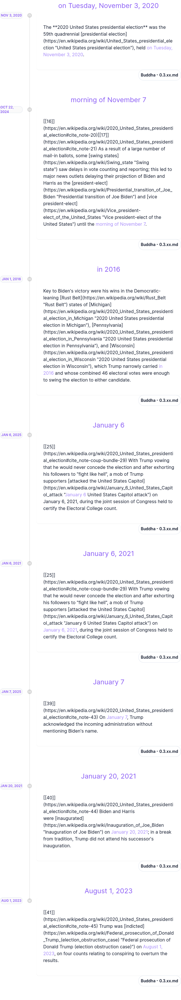
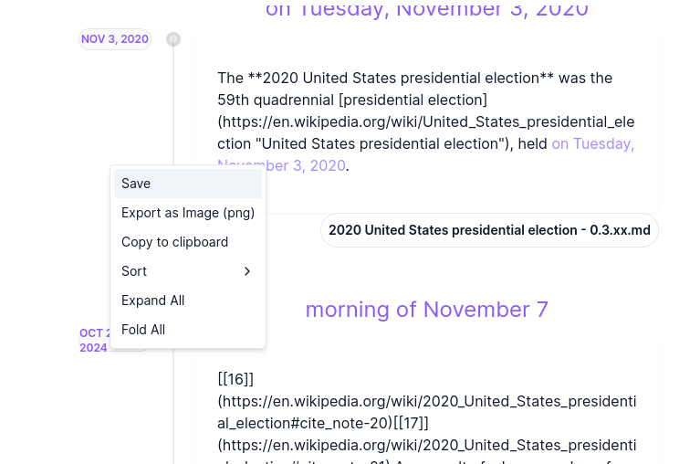
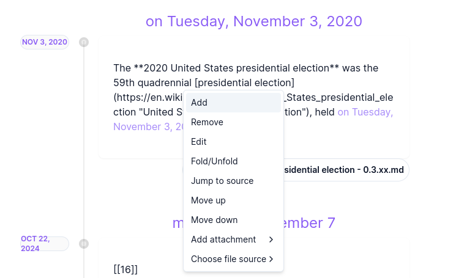
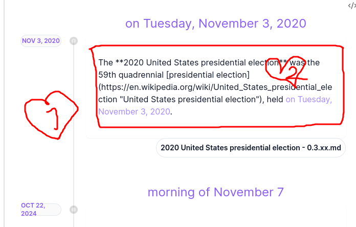
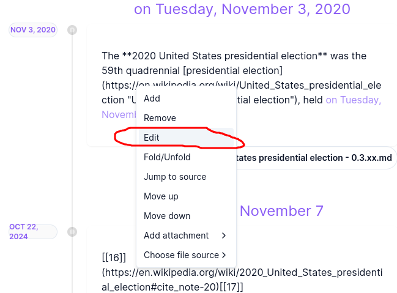
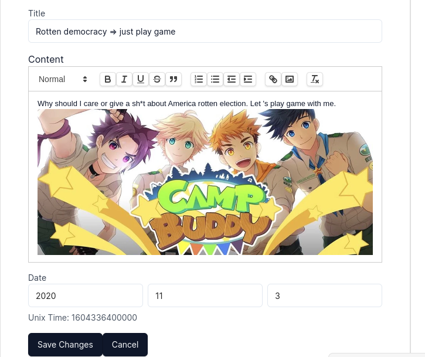
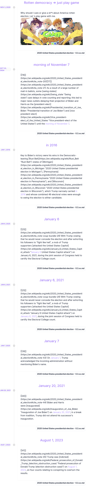
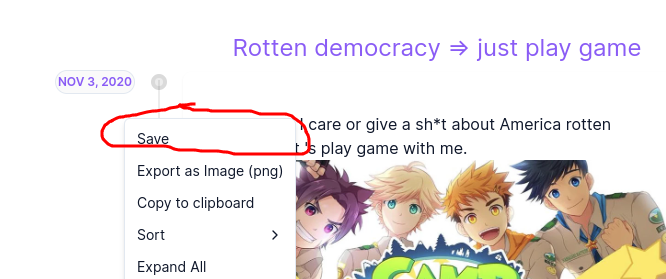
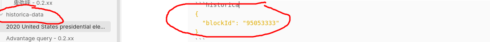

<div align="center" style="color:#b300ff">
<sub>
(Not) Smart and dynamic extraction point of time in your note
</sub>
</div>

------------------------------------------------------------------------

<ul>

<li>

(Not) Smart and dynamic extraction point of time in your note or multi notes
</li>

<li>

visualize the time in your note
</li>

<li>

Give you the abilities (but I am not sure if they will give you absolute freedom) to custom your timeline
</li>

</ul>

------------------------------------------------------------------------

### The most basic

- Just create a `historica` block

<!-- -->

    ```historica
    ```

- After you did that, the block will just work, it will read the content in the current file (except anything in the code block). Split them to sentences, and if a sentence have a string that can be parsed as date or time. It will show up in the timeline
- Well, in the legacy versions, I try to support multiple languages, but I realize it just the technical dept, why I try to support languages that I'm never using. So Historica will just support only English.
- Below is the example when I try to extract the first paragraph from https://en.wikipedia.org/wiki/2020_United_States_presidential_election . You can check the example at [2020 United States presidential election - 0.3.xx](2020 United States presidential election - 0.3.xx "wikilink")

<details>
<summary>Plot</summary>



</details>

### More customize
- And you can try to toy with so many funny thing when you right-click/ or hold your finger long enough in the screen if you're using mobile - to trigger the context menu.

<details>
<summary>plot</summary>

<figure>

<figcaption
aria-hidden="true">Pastedimage20241022233205.png</figcaption>
</figure>

</details>

<details>
<summary>plot</summary>
<figure>

<figcaption
aria-hidden="true">Pastedimage20241022233235.png</figcaption>
</figure>
</details>

> [!note]
> Oh remember that if you open context menu in the content areas (number 2)- and the area outside them (number 1) - different menu will appear - Menu 1 intend for interactive in the entire timeline, and so we have the opposite with menu 2 for each plot event

<details>
<summary>plot</summary>
<figure>

<figcaption
aria-hidden="true">Pastedimage20241022233635.png</figcaption>
</figure>
</details>

- Let see, I want to create a add funny detail on our plot.

- I will click `edit` and edit our timeline like a Brotato
 <details>



</details>

- And hehe, now I can edit anything I want in the rich text editor, even add an image to it (by copy-paste)
<details>



</details>

- And now we have the result
<details>



</details>

- That all, but wait, we still not finish, please remember to SAVE YOUR PLOT, there is two way to save it

- Via manual save like below

<details>



</details>


- Well, you will see that the data will be saved in a json file in `historica-data/xxxx.json`. Well, and the block will be modified to store the file id. Next time, if this block need to render, it will load from that file instead of recompute. 
- Or you can manual change the blockId to any string, when the id is different from "-1", everytime you edit your timeline, the  autosave will trigger.
- Ah, I need to remind you that you can open the historica-data directory to check how the data was saved, they are just json. But by default Obsidian cannot view json file, please using other tool and please don't being confused when there is nothing being shown via the Files panel.

<details>

<figure>

<figcaption
aria-hidden="true">Pastedimage20241022235212.png</figcaption>
</figure>

</details>

