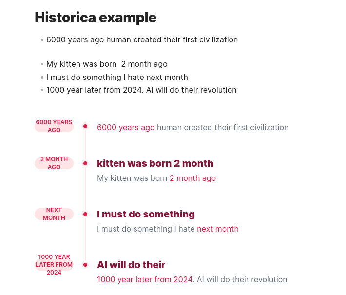
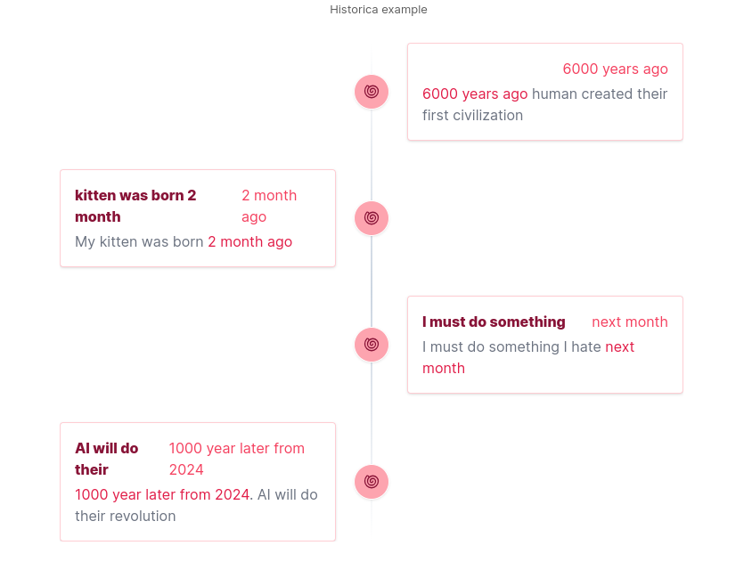

<h1
    align="center"
>Historica</h1>

<div align="center"><font color="#601b15">
<sub> (Not) Smart and dynamic extraction point of time in your note or multi notes</sub>

</div>

---


<ul>

- _(Not) Smart and dynamic extraction_ point of time in your note or multi notes</li>
- _Auto sort_ and _visualize_ the time in your note 
- Support 2 styles of visualization
- _(Not) Smart generate the summary_ of content releated to the point of time in your note
- Multi files support

</ul>

---

<div><sub>Simply create a historica code block somewhere in your file </sub> </div>

````markdown
 ```historica

 ```
````

<div align="right"
><sub>No need any configuration to make it work</sub></div>

---


<div><sub>Oh, you want more configuration?</sub></div>


````markdown
```historica

style=1 
 
include_files=["file1.md", "sub_dir/file2.md", "sub_dir2/sub_dir3/file3.md] 

```
````

<div align="right">
<sub>Style maybe 1 or 2</sub>

<sub>Directories in include_files is releative path to vault directory </sub>
</div>

---

<div align="center"><font color="#ff3c52">
Style 1
</font></div>



---

<div align="center"><font color="#ff3c52">
Style 2
</font></div>




<div align="center">
<sub>It is not smart like it seem. Just like me</sub>
</div>

