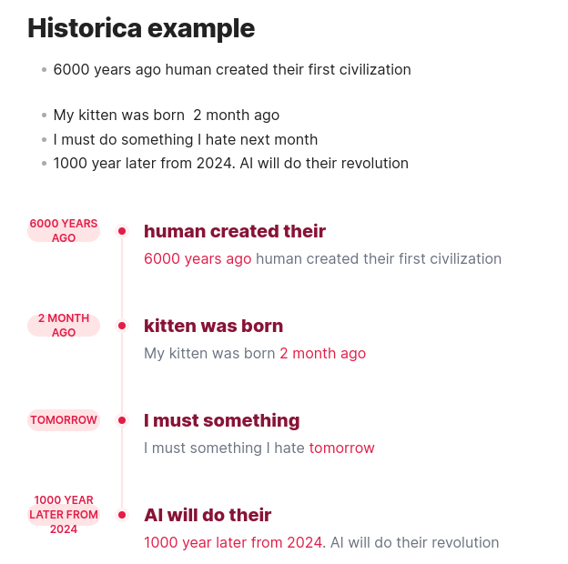
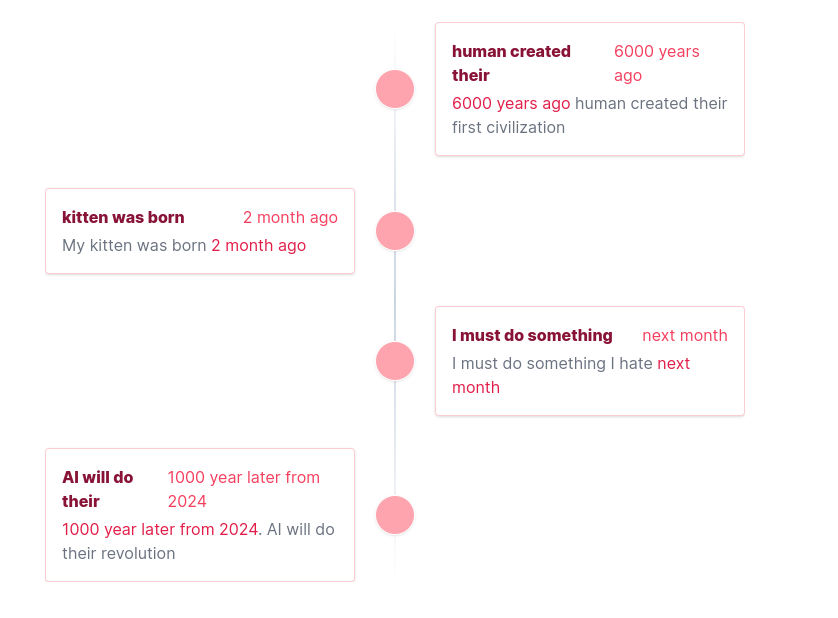

<h1 align="center" >
<font color="#ff3c52">Historica</font>
</h1>

<div align="center"><font color="#601b15">
Smart and dynamic extraction point of time in your note or multi notes

</font></div>
>[!info]
> 
> Smart and dynamic extraction point of time in your note or multi notes
> 
> Auto sort and visualize the time in your note
> 
> Support 2 styles of visualization
> 
> Smart generate the summary of time in your note
> 
> Multi files support

- Simply create the block with name `historica`

>\```historica
>
>\```


- Tada the all sentences with time will be dynamic extracted and visualize
- Oh, you want more configuration?

> \```historica
> 
> style=1 `supports 2 style:  1 or 2 columns`
> 
> include_files=["file1.md", "file2.md"]  `include files, the name of file must include folder or parent directory if needed`
> 
> \```

<div align="center"><font color="#ff3c52">
Style 1
</font></div>



<div align="center"><font color="#ff3c52">
Style 2
</font></div>


