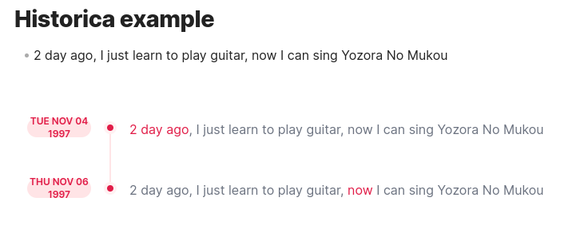
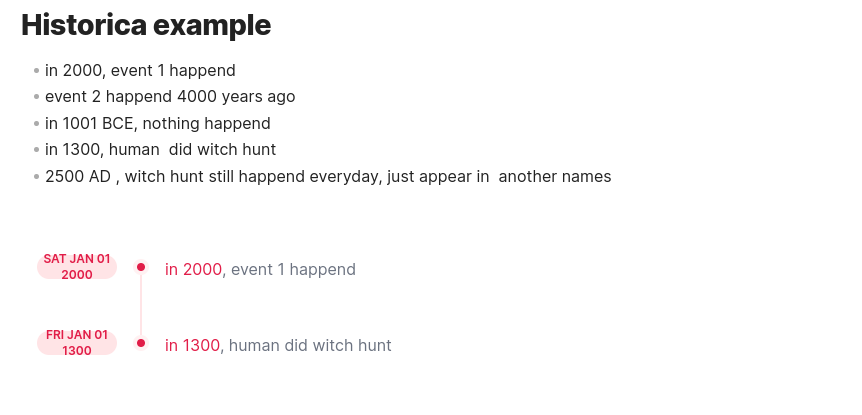
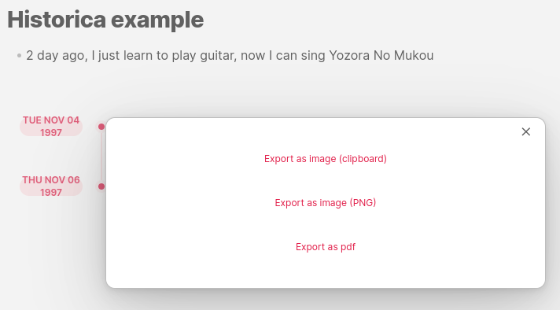

<h1
    align="center"
>Historica</h1>

<div align="center">
<sub> (Not) Smart and dynamic extraction point of time in your note or multi notes</sub>

</div>

---


<ul>

- _(Not) Smart and dynamic extraction_ point of time in your note or multi notes
- _Auto sort_ and _visualize_ the time in your note 
- Support for two styles of visualization
- _(Not) Smart generate the summary_ of content related to the point of time in your note
- Multi files support
- Export your timeline as image/pdf or copy it to clipboard

</ul>

---
<div align="center">What! Another <b>GPT</b> tools again 😢

</div>

<div align="left">
<details>
<summary> <sub> No 😍, it is not</sub> </summary>
<sub>There is no heavy GPT or any remote server involve, just classic NLP that make sure anything as much fast as possible</sub>
</details></div>

---

###### Simplest use case

<div><sub>Simply create a historica code block somewhere in your file </sub> </div>

````markdown
 ```historica

 ```
````

<div align="right"
><sub>No need any configuration to make it work</sub></div>

---


<div><sub>Oh, you want more configuration?</sub></div>

---

###### Includes multi files

````toml
```historica

style=1 
 
include_files=["file1.md", "sub_dir/file2.md", "sub_dir2/sub_dir3/file3.md] 

```
````

<div align="right">
<sub>Style maybe 1 or 2</sub>

<sub>Directories in include_files are relative paths to vault directory </sub>
</div>

> [!tip]
> You can use "all" (without an array notation) to include all files in vault, this option is not encouraged because, it
> is a heavy task, and Historica not good at detecting non-English string

---

###### Pin special point of time as "now"

<div align="center">
<sub>
Historica smart enough to work with all related time phrases like "now," "2 days ago",
But it is also mean those related point of time always be parsed from current time from your system.
So now you can pin a point of time as "now," also using natural language too.
</sub>
</div>

````toml
```historica
pin_time="1997/Jun/12"
```
````



<div align="right">
<sub>
Historica can even parse timezone too, just input pin_time like this "1997/Jun/12 GTM+7"?
</sub>
</div>

---

###### Query your time strictly

<div align="center">
<sub>
Give a stricter query by specific multi time ranges
</sub>
</div>

````toml

```historica
[query.from-1997-to-2022]  
start="1997/Jun/12"  
end="2022/Jun/13"  
  
[query.from-1000-to-1500]  
start="1000/Jun/12"  
end="1500/Jun/13"

```

````



> [!tip]
> Historica using `toml` as configuration syntax, so a table/table array is the syntax to define your query. You can
> check more of them [here](https://toml.io/en/v1.0.0#table)

###### Export or copy the timeline

Just right-click anywhere in the timeline. The helper menu will appear.



---

<div align="center"><font color="#ff3c52">
Style 1
</font></div>


---

<div align="center"><font color="#ff3c52">
Style 2
</font></div>


<div align="center">
<sub>It is not smart like it seems. Just like me</sub>
</div>


