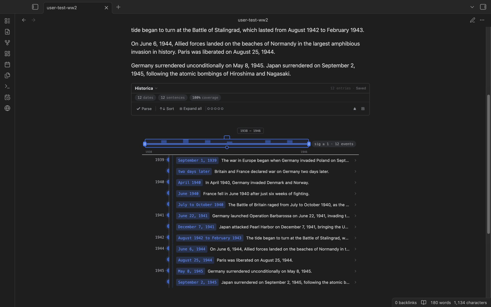
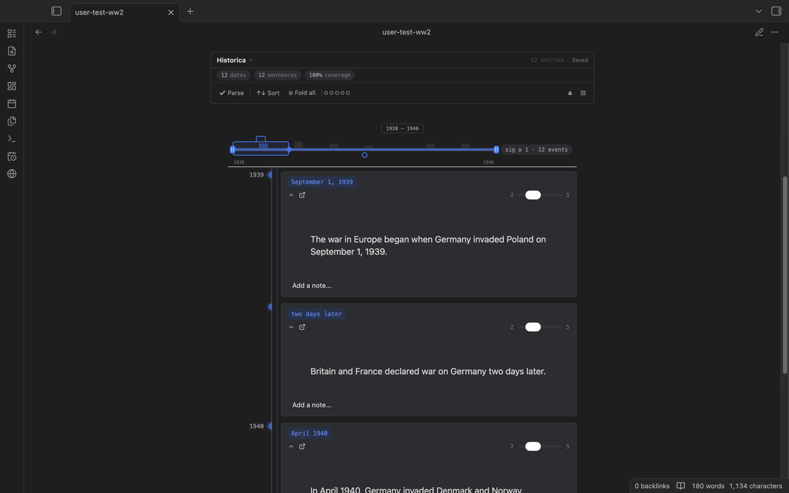
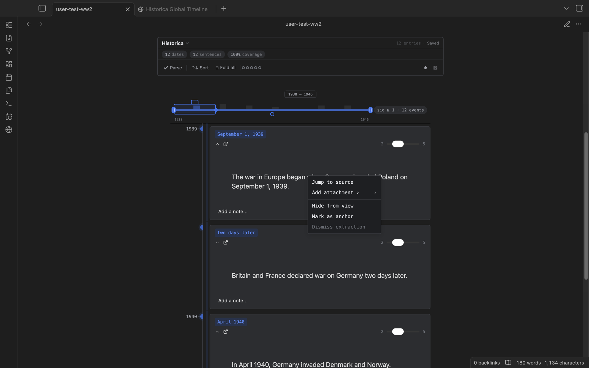

<h1 align="center">Historica</h1>

<p align="center"><b>Turn prose into a timeline, automatically.</b><br/>
An Obsidian plugin that reads your notes, finds every date with NLP, and renders an interactive timeline - right inside a code block.</p>



<p align="center"><sub>Real screenshot, not a mock: the note's prose above, the timeline it produced below. More shots in <a href="showcase/">showcase/</a>. The marketing site source lives at <a href="website/">website/</a>.</sub></p>

---

> [!note]
> These docs cover version 0.3.xx and above, which changed the UX/UI heavily compared to legacy versions. Desktop only - mobile support was dropped in 0.3.
>
> User documentation: https://historica.pages.dev\
> API documentation: https://obsidian-historica-code-doc.pages.dev/

## Quick start

Create a `historica` block in any note:

````
```historica
```
````

That is it. The block reads the content of the current file (everything except code blocks), splits it into sentences, and every sentence containing a string that parses as a date or time shows up in the timeline.

## Languages

Historica is English-first, but it also parses several other languages. By default the `language` setting is `auto`: it detects the language of each note and picks the matching parser. Besides English it currently handles German, French, Japanese, Chinese, Dutch, and Vietnamese (English has the richest coverage; the others focus on absolute dates, months, centuries, and eras). You can also pin a language explicitly instead of `auto`.

Parsing is tested against real annotated corpora (WikiWarsDE, WikiWars-NL, French FTiB, and hand-curated Japanese and Chinese sets). See [docs/test-datasets.md](docs/test-datasets.md).

## Editing and context menus

Right-click the timeline to open the context menus. There are two: one for actions that affect the entire timeline (sort, export, save, re-parse) and one for a single plot unit (edit, re-date, annotate, dismiss). The `edit` action opens a rich text editor where you can rewrite an entry however you like - even paste images into it. See the [user documentation](https://historica.pages.dev) for the full tour with screenshots.





## Save your plot

A fresh empty `historica` block is bound to the hidden blockId `-1`, and blocks with blockId `-1` do not auto-save: re-render the block and your customizations are gone. So save the plot:

- Right-click, global context menu, `save`. The data is written to `historica-data/xxxx.md` and the block is modified to store the file id. From then on every change auto-saves.
- Or give the block an id yourself when you create it:

````
```historica
{
"blockId":"It-is-so-kute-and-I-know-it"
}
```
````

Now the block auto-saves to `historica-data/It-is-so-kute-and-I-know-it.md`.

Saved timelines are plain Markdown in the HMD format - YAML frontmatter for settings, one `## heading` per entry, inline fields for date and significance. Obsidian can open and even render them directly; you can read, diff, grep, and hand-edit them. The format spec is in [docs/hmd-spec.md](docs/hmd-spec.md).

## Install

- Obsidian: Settings, Community plugins, search for `Historica`.
- Manual: grab `main.js`, `manifest.json`, and `styles.css` from the [latest release](https://github.com/nhannht/obsidian-historica/releases/latest) and drop them into `.obsidian/plugins/historica/`.

## License

MIT
