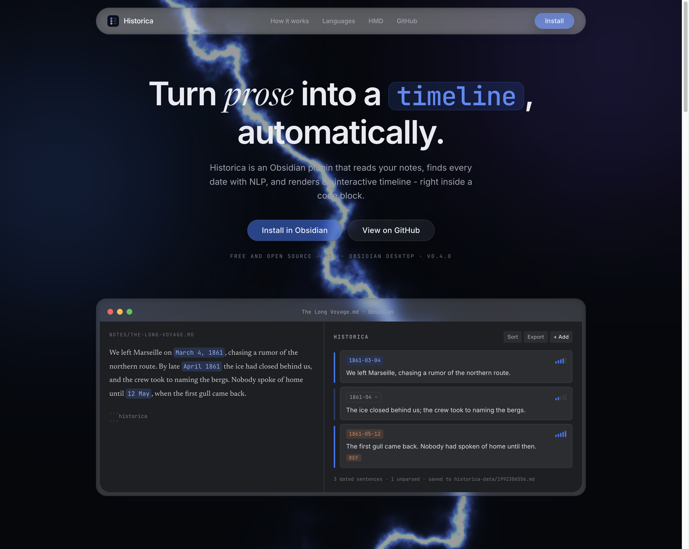

<h1 align="center">Historica</h1>

<p align="center"><b>Turn prose into a timeline, automatically.</b><br/>
An Obsidian plugin that reads your notes, finds every date with NLP, and renders an interactive timeline - right inside a code block.</p>



<p align="center"><sub>More shots in <a href="showcase/">showcase/</a>. The marketing site source lives at <a href="website/">website/</a>.</sub></p>

<div align="center" style="color:red">
<sub>
(Not) Smart and dynamic extraction point of time in your note
</sub>
</div>

---


<ul>

<li>(Not) Smart and dynamic extraction point of time in your note</li>
<br/>
<li> Easy to create timeline </li>
<br/>
<li>Give you the abilities (but I am not sure they will give you absolute freedom) to custom the most aesthetic timeline </li>


</ul>

---

>[!note]
>These documents for version 0.3.xx and above, which have many breaking change in ux/ui compared to legacy versions. And from this version I dropped support for mobile.

>[!note]
> The user document is https://historica.pages.dev
> The programming document is https://obsidian-historica-code-doc.pages.dev/

### The most basic
- Just create a `historica` block

````
```historica
```
````

- After you did that, the block will just work, it will read the content in the current file (except anything in the code block). Split them to sentences, and if a sentence have a string that can be parsed as date or time. It will show up in the timeline
- Historica is English-first, but it also parses several other languages. By default the `language` setting is `auto`: it detects the language of each note and picks the matching parser. Besides English it currently handles German, French, Japanese, Chinese, Dutch, and Vietnamese (English has the richest coverage; the others focus on absolute dates, months, centuries, and eras). You can also pin a language explicitly instead of `auto`.
- Below is the example when I try to extract the first paragraph from https://en.wikipedia.org/wiki/2020_United_States_presidential_election .


### More customizes - contexts menu
- And you can try to toys with so many funny things  by right clicking  to trigger the context menu. Historica support 2 main context menus. One for action that affect the entire timeline/global context and one that affect single plot unit


![[historica_document/attachments/Pasted image 20241022233635.png]]

- Let see, I want to create a add funny detail on our plot.
- I will click `edit` and edit our timeline like a [Brotato](https://store.steampowered.com/app/1942280/Brotato/)

- And he-he, now I can edit anything I want in the rich text editor, even add an image to it (by copy-paste)


- and now we have the results


#### Details about context menus
- [timline menu](historica_document/timline%20menu.md)
- [unit menu](historica_document/unit%20menu.md)
 
### About UI
- [UI - timeline](UI%20-%20timeline.md)
- [UI - unit](UI%20-%20unit.md)


### Save you plot
- That all, but wait, we still not finish, please remember to SAVE YOUR PLOT, by default, with an empty Historica block. The block will be binding with a hidden blockId "-1". Any block with blockId "-1" will not auto save. And everytime you rerender the block, all customizes you add will be lost, or you need to recompute to extract time using NLP again. So how to save the plot. We have so many way, by right click global context menu -> save

 

- Well, you will see that the data will be saved as a Markdown file (the HMD format) in `historica-data/xxxx.md`. Well, and the block will be modified to store the file id. After the block is binded with the id other than "-1". Any custom data you add will be autosave. 
- Or the second way, when you first create the block, manual add a id with any text you want to it. Example
````
```historica
{
"blockId":"It-is-so-kute-and-I-know-it"
}
```
````
Now, the block will be autosave the `historica-data/It-is-so-kute-and-I-know-it.md` file 
- Ah, I need to remind you that you can open the historica-data directory to check how the data was saved. They are just Markdown files (the HMD format - YAML frontmatter for settings, one `## heading` per entry), so Obsidian can open and even render them directly. The format spec is in [docs/hmd-spec.md](docs/hmd-spec.md).


